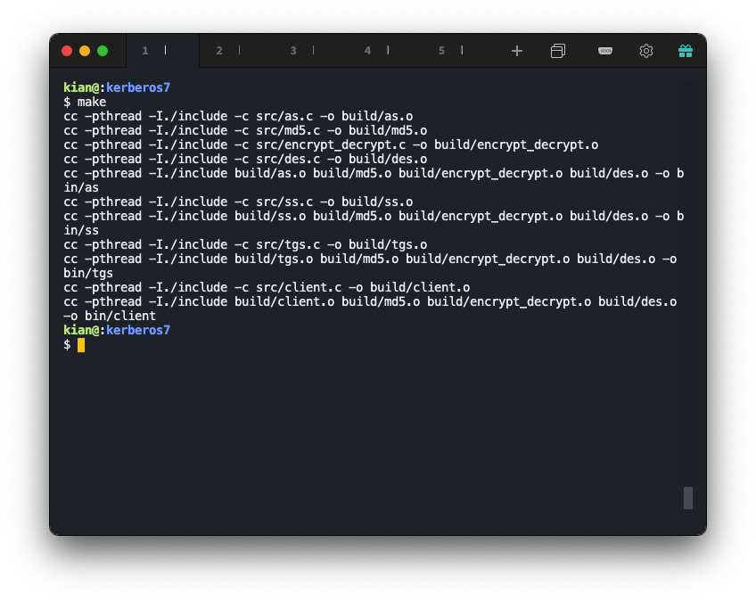
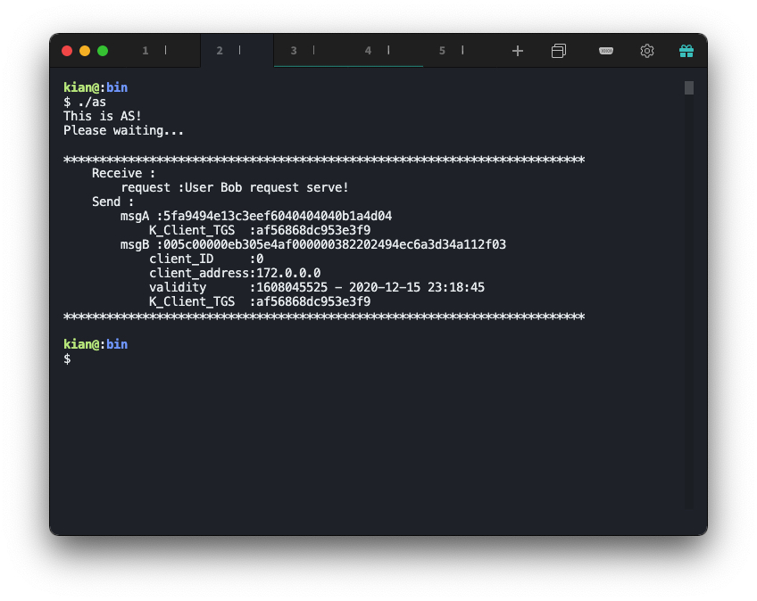
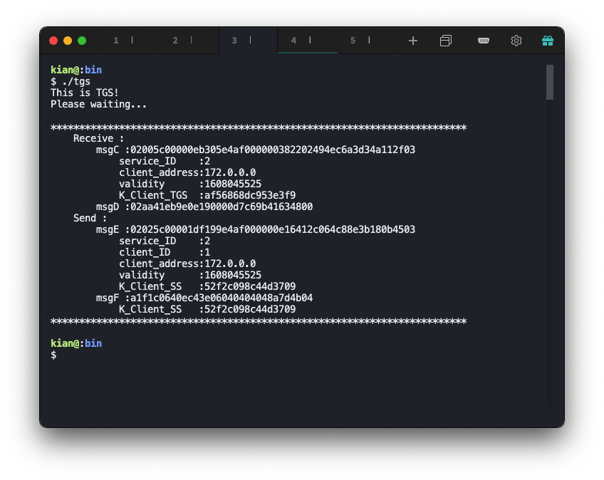
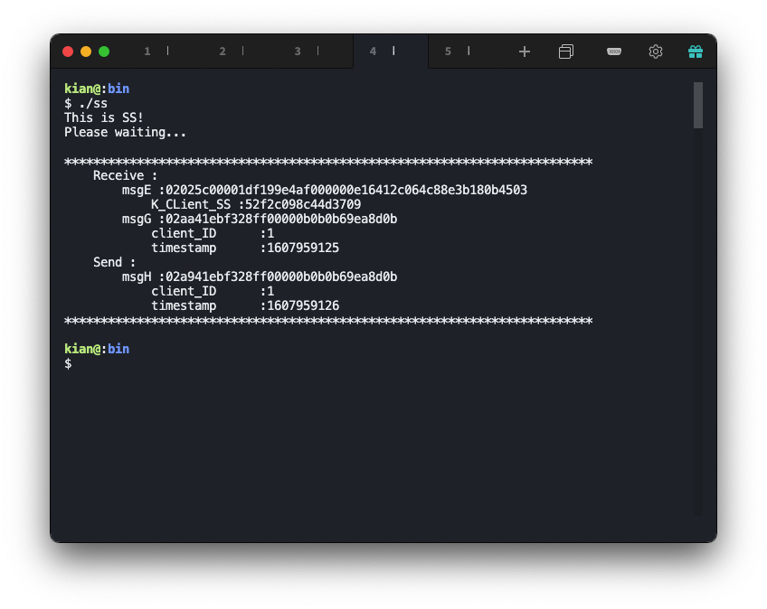

# 单主机 Kerberos  认证模拟

### 环境说明

操作系统：`Ubuntu 18.04.4 LTS (GNU/Linux 4.15.0-96-generic x86_64)`

编译工具：`gcc version 7.5.0 (Ubuntu 7.5.0-3ubuntu1~18.04)` 

## 总体结构设计

> kerberos 是一种计算机网络身份验证协议，可构成基于对称密钥的 kerberos 认证系统

结构树如下

```shell
$ tree
.
├── include
│   ├── as.h
│   ├── client.h
│   ├── des.h
│   ├── encrypt_decrypt.h
│   ├── md5.h
│   ├── message.h
│   ├── ss.h
│   └── tgs.h
├── Makefile
└── src
    ├── as.c
    ├── client.c
    ├── des.c
    ├── encrypt_decrypt.c
    ├── md5.c
    ├── ss.c
    └── tgs.c
```

* `client.c` 代表客户端
* `as.c` 代表 AS
* `tgs.c` 代表 TGS
* `ss.c` 代表 SS
* `des.c` 是 DES 加密解密算法
* `encrypt_decrypt.c` 是对 DES 的一层包装，使 DES 使用更方标
* `md5.c` 是 MD5 哈希算法，用于生成密钥

各个文件会分别利用 `mkfifo` 创建命名管道，在管道中实现进程间通信。

## 模块分解

### 进程间通信模块

进程间通信我选择利用命名管道通信。

#### C 语言命名管道说明

命名管道即 FIFO 文件，它是一种特殊类型的文件，在文件系统中以文件名的形式存在。

创建命名管道可以使用以下函数，其中 mode 指定了文件的读写权限

```c
#include <sys/types.h>
#include <sys/stat.h>
int mkfifo(const char *filename, mode_t mode);
```

打开 FIFO 管道文件可以使用 open 函数，open 函数需要设置为只读 O_RDONLY 或只写 O_WRONLY 模式，不能设为既可读又可写模式。

```c
open(const char *path, O_RDONLY);
open(const char *path, O_WRONLY);
```

FIFO 管道文件在打开时还可以选择是否使用非阻塞模式，当以只读方式打开 FIFO 文件时，如果open 调用是阻塞的，除非有一个进程以写方式打开同一个 FIFO，否则它不会返回；如果open调用是非阻塞的的 O_NONBLOCK，则即使没有其他进程以写方式打开同一个FIFO文件，open调用将成功并立即返回。

```c
open(const char *path, O_RDONLY | O_NONBLOCK);
open(const char *path, O_WRONLY | O_NONBLOCK);
```

在本实验中，FIFO 管道文件均以阻塞模式打开。

#### 服务端的管道通信

```c
int main() {
    umask(0);
    if (mkfifo("../pip/pip-server",0644) < 0) {     //创建一个命名管道
        ERR_EXIT("mkfifo");
    }
    // ...
}
unsigned int receive_from_client(unsigned char *msg, unsigned int len_msg) {
    int rfd = open("../pip/pip-server",O_RDONLY);
    if (rfd < 0) {
        ERR_EXIT("open");
    }
    read(rfd, msg, len_msg);
    close(rfd);
    return 0;
}
void send_to_client(unsigned char *msg, unsigned int len_msg) {
    int wfd = open("../pip/pip-client", O_WRONLY);
    if (wfd < 0) {
        ERR_EXIT("open");
    }
    write(wfd, msg, len_msg);
    close(wfd);
    return ;
}
```

#### 客户端的管道通信

```c
void send_to_server(unsigned char *msg, unsigned int len_msg, unsigned char server) {
    int wfd = -1;
    switch (server) {
    case AS:
        wfd = open("../pip/pip-as", O_WRONLY);
        break;
    case TGS:
        wfd = open("../pip/pip-tgs", O_WRONLY);
        break;
    case SS:
        wfd = open("../pip/pip-ss", O_WRONLY);
        break;
    }
    if (wfd < 0) {
        ERR_EXIT("open pip");
    }
    write(wfd, msg, len_msg);
    close(wfd);
    return ;
}
void receive_from_server(unsigned char *msg, unsigned int len_msg,unsigned char *msg2, unsigned int len_msg2, unsigned char server) {
    int rfd = -1;
    switch (server) {
    case AS:
        rfd = open("../pip/pip-client1", O_RDONLY);
        break;
    case TGS:
        rfd = open("../pip/pip-client2", O_RDONLY);
        break;
    case SS:
        rfd = open("../pip/pip-client3", O_RDONLY);
        break;
    }
    if (rfd < 0) {
        ERR_EXIT("open pip");
    }
    read(rfd, msg, len_msg);
    if (len_msg2) read(rfd, msg2, len_msg2);
    close(rfd);
    return ;
}
int main() {
    umask(0);
    if (mkfifo("../pip/pip-client1",0644) < 0) {     //创建一个命名管道
        ERR_EXIT("mkfifo");
    }
    if (mkfifo("../pip/pip-client2",0644) < 0) {     //创建一个命名管道
        ERR_EXIT("mkfifo");
    }
    if (mkfifo("../pip/pip-client3",0644) < 0) {     //创建一个命名管道
        ERR_EXIT("mkfifo");
    }
    // ...
}
```

### Client 端

与 AS 通信

* 发送请求

    ```c
    send_to_server(request, len_request, NULL, 0, AS);
    ```

* 接收消息 A、消息 B

    ```c
    receive_from_server(msgA, LEN_MSG_A, msgB, LEN_MSG_B, AS);
    ```

* 利用 K_Client 解析消息 A 获取 K_Client_TGS

    ```c
    void analysis_msgA(unsigned char *K_Client_TGS, unsigned char *msgA, unsigned char *K_Client) {
        unsigned char *msgA_plaintext = (unsigned char *) malloc (LEN_MSG_A * sizeof(unsigned char)); memset(msgA_plaintext, 0, LEN_MSG_A);
        decrypt(msgA_plaintext, msgA, LEN_MSG_A, K_Client);
        memcpy(K_Client_TGS, msgA_plaintext, LEN_KEY);
        // ...
    }
    ```

与 TGS 通信

* 生成消息 C，消息 C 里包含了 service_ID 和消息 B

    ```c
    void gene_msgC(unsigned char *msgC, unsigned char *service_ID, unsigned char *msgB) {
        memcpy(msgC, service_ID, LEN_ID);
        memcpy(msgC + LEN_ID, msgB, LEN_MSG_B);
    }
    ```

* 利用 K_Client_TGS 生成消息 D，消息 D 里包含了 client_ID，timestamp。

    ```c
    void gene_msgD(unsigned char *msgD, unsigned char *client_ID, time_t *timestamp, unsigned char *K_Client_TGS) {
        unsigned char msgD_plaintext[LEN_MSG_D];
        unsigned int len = 0;
        memcpy(msgD_plaintext + len, client_ID, LEN_ID); len += LEN_ID;
        memcpy(msgD_plaintext + len, (void *)timestamp, LEN_TIME); len += LEN_TIME;
        encrypt(msgD, msgD_plaintext, LEN_MSG_D, K_Client_TGS);
        return ;
    }
    ```

* 发送消息 C、消息 D

    ```c
    send_to_server(msgC, LEN_MSG_C, msgD, LEN_MSG_D, TGS);
    ```

* 获取消息 E、消息 F

    ```c
    receive_from_server(msgE, LEN_MSG_E, msgF, LEN_MSG_F, TGS);
    ```

* 利用 K_Client_TGS 解析消息 F 获得 K_CLient_SS

    ```c
    void analysis_msgF(unsigned char *K_CLient_SS, unsigned char *msgF, unsigned char *K_Client_TGS) {
        printf("    Analysis :\n");
        unsigned char *msgF_plaintext = (unsigned char *) malloc (LEN_MSG_F * sizeof(unsigned char)); memset(msgF_plaintext, 0, LEN_MSG_F);
        memset(msgF_plaintext, 0, LEN_MSG_F);
        decrypt(msgF_plaintext, msgF, LEN_MSG_F, K_Client_TGS);
        memcpy(K_CLient_SS, msgF_plaintext, LEN_KEY);
        printf("        K_CLient_SS :");
        for (int i = 0; i < LEN_KEY; ++i) {
            printf("%02x", K_CLient_SS[i]);
        }
        putchar(10);
        free(msgF_plaintext);
        return ;
    }
    ```

与 SS 通信

* 利用 K_CLient_SS 生成消息 G，消息 G 里包含了 client_ID 和 timestamp。

    ```c
    void gene_msgG(unsigned char *msgG, unsigned char *client_ID, time_t *timestamp, unsigned char *K_CLient_SS) {
        unsigned char *msgG_plaintext = (unsigned char *) malloc (LEN_MSG_G * sizeof(unsigned char)); memset(msgG_plaintext, 0, LEN_MSG_G);
        int len_msgG_plaintext = 0;
        memcpy(msgG_plaintext + len_msgG_plaintext, client_ID, LEN_ID); len_msgG_plaintext += LEN_ID;
        memcpy(msgG_plaintext + len_msgG_plaintext, (void *)timestamp, LEN_TIME); len_msgG_plaintext += LEN_TIME;
        encrypt(msgG, msgG_plaintext, len_msgG_plaintext, K_CLient_SS);
        free(msgG_plaintext);
        return ;
    }
    ```

* 发送消息 E、消息 G

    ```c
    send_to_server(msgE, LEN_MSG_E, msgG, LEN_MSG_G, SS);
    ```

* 接收消息 H 

    ```c
    receive_from_server(msgH, LEN_MSG_H, NULL, 0, SS);
    ```

* 利用 K_CLient_SS 解析消息 H 并验证时间戳

    ```c
    void analysis_msgH(unsigned char *msgH, time_t timestamp, unsigned char *K_CLient_SS) {
        printf("    Analysis :\n");
        time_t timestamp_from_SS = -1;
        unsigned char *msgH_plaintext = (unsigned char *) malloc (LEN_MSG_H * sizeof(unsigned char)); memset(msgH_plaintext, 0, LEN_MSG_H);
        decrypt(msgH_plaintext, msgH, LEN_MSG_H, K_CLient_SS);
        memcpy((void *)&timestamp_from_SS, msgH_plaintext + LEN_ID, LEN_TIME);
        printf("        timestamp_from_SS %ld\n", timestamp_from_SS);
        if (timestamp_from_SS - timestamp == 1) {
            printf("Success!\n");
        }
        free(msgH_plaintext);
        return ;
    }
    ```

### AS 端

* 接收客户端请求

    ```c
    unsigned int receive_from_client(unsigned char *msg, unsigned int len_msg) {
        int rfd = open("../pip/pip-as",O_RDONLY);
        if (rfd < 0) {
            ERR_EXIT("open");
        }
        size_t s = read(rfd, msg, len_msg);
        close(rfd);
        return s;
    }
    ```

* 利用 K_Client 生成消息 A，消息 A 里包含了 K_Client_TGS

    ```c
    void gene_msgA(unsigned char *msgA, unsigned char *K_Client, unsigned char *K_Client_TGS) {
        encrypt(msgA, K_Client_TGS, LEN_KEY, K_Client);
    }
    ```

* 利用 K_TGS 生成消息 B，消息 B 里包含了 client_ID、client_address、validity 和 K_Client_TGS。

    ```c
    void gene_msgB(unsigned char *msgB, unsigned char *client_ID, 
                                        unsigned char *client_address, 
                                        time_t *validity, 
                                        unsigned char *K_Client_TGS, unsigned char *K_TGS) {
        unsigned char msgB_plaintext[LEN_MSG_B];
        unsigned int len = 0;
        memcpy(msgB_plaintext + len, client_ID, LEN_ID); len += LEN_ID;
        memcpy(msgB_plaintext + len, client_address, LEN_IP); len += LEN_IP;
        memcpy(msgB_plaintext + len, (void *)validity, LEN_TIME); len += LEN_TIME;
        memcpy(msgB_plaintext + len, K_Client_TGS, LEN_KEY); len += LEN_KEY;
    
        encrypt(msgB, msgB_plaintext, len, K_TGS);
        return ;
    }
    ```

* 发送消息 A、消息 B

    ```c
    send_to_client(msgA, LEN_MSG_A, msgB, LEN_MSG_B);
    ```

### TGS 端

* 接收消息 C、消息 D

    ```c
    receive_from_client(msgC, LEN_MSG_C, msgD, LEN_MSG_D);
    ```

* 解析消息 C 得到消息 B

    ```c
    void analysis_msgC(unsigned char *service_ID, unsigned char *msgB, unsigned char *msgC) {
        memcpy(service_ID, msgC, LEN_ID);
        memcpy(msgB, msgC + LEN_ID, LEN_MSG_B);
    }
    ```

* 利用 K_TGS 解析消息 B 获得 client_address、validity、K_Client_TGS。

    ```c
    void analysis_msgB(unsigned char *client_address, time_t *validity, unsigned char *K_Client_TGS, unsigned char *msgB, unsigned char *K_TGS) {
        unsigned char *msgB_plaintext = (unsigned char *) malloc (LEN_MSG_B * sizeof(unsigned char)); memset(msgB_plaintext, 0, LEN_MSG_B);
        decrypt(msgB_plaintext, msgB, LEN_MSG_B, K_TGS);
    
        memcpy(client_address, msgB_plaintext + LEN_ID, LEN_IP);
        memcpy((void *)validity, msgB_plaintext + LEN_ID + LEN_IP, LEN_TIME);
        memcpy(K_Client_TGS, msgB_plaintext + LEN_ID + LEN_IP + LEN_TIME, LEN_KEY);
        free(msgB_plaintext);
    }
    ```

* 利用 K_Client_TGS 解析消息 D 获得 client_ID。

    ```c
    void analysis_msgD(unsigned char *client_ID_from_D, unsigned char *msgD, unsigned char *K_Client_TGS) {
        unsigned char *msgD_plaintext = (unsigned char *) malloc (LEN_MSG_D * sizeof(unsigned char)); 
        memset(msgD_plaintext, 0, LEN_MSG_D);
        decrypt(msgD_plaintext, msgD, LEN_MSG_D, K_Client_TGS);
        memcpy(client_ID_from_D, msgD_plaintext, LEN_ID);
        free(msgD_plaintext);
    }
    ```

* 利用 K_SS 生成消息 E，消息 E 里包含了 ST 和 service_ID，ST 里包含了 client_ID、client_net_address、validity 和 K_Client_SS。

    ```c
    void gene_msgE(unsigned char *msgE, unsigned char *service_ID, unsigned char *client_ID, unsigned char *client_net_address, time_t *validity, unsigned char *K_Client_SS, unsigned char *K_SS) {
        int len_ST = 24;
        unsigned char *ST_plaintext = (unsigned char *) malloc (len_ST * sizeof(unsigned char)); memset(ST_plaintext, 0, len_ST);
        
        int len_ST_plaintext = 0;
        memcpy(ST_plaintext + len_ST_plaintext, client_ID, LEN_ID); len_ST_plaintext += LEN_ID;
        memcpy(ST_plaintext + len_ST_plaintext, client_net_address, LEN_IP); len_ST_plaintext += LEN_IP;
        memcpy(ST_plaintext + len_ST_plaintext, (void *)validity, LEN_TIME); len_ST_plaintext += LEN_TIME;
        memcpy(ST_plaintext + len_ST_plaintext, K_Client_SS, LEN_KEY); len_ST_plaintext += LEN_KEY;
    
        unsigned char *ST = (unsigned char *) malloc (len_ST * sizeof(unsigned char)); memset(ST, 0, len_ST);
        encrypt(ST, ST_plaintext, len_ST_plaintext, K_SS);
    
        memcpy(msgE, service_ID, LEN_ID);
        memcpy(msgE + LEN_ID, ST, len_ST);
    
        free(ST);
        free(ST_plaintext);
        return ;
    }
    ```

* 利用 K_Client_TGS 生成消息 F，消息 F 里包含了 K_Client_SS

    ```c
    void gene_msgF(unsigned char *msgF, unsigned char *K_Client_SS, unsigned char *K_Client_TGS) {
        encrypt(msgF, K_Client_SS, LEN_KEY, K_Client_TGS);
    }
    ```

* 发送消息 E、消息 F

    ```c
    send_to_client(msgE, LEN_MSG_E, msgF, LEN_MSG_F);
    ```

### SS 端

* 接收消息 E、消息 G

    ```c
    receive_from_client(msgE, LEN_MSG_E, msgG, LEN_MSG_G);
    ```

* 利用 K_SS 解析消息 E 获取 K_CLient_SS

    ```c
    void analysis_msgE(unsigned char *K_CLient_SS, unsigned char *msgE, unsigned char *K_SS) {
        int len_ST = 24;
        unsigned char *ST = (unsigned char *) malloc (len_ST * sizeof(unsigned char)); 
        memset(ST, 0, len_ST);
        memcpy(ST, msgE + LEN_ID, len_ST);
    
        unsigned char *ST_plaintext = (unsigned char *) malloc (256 * sizeof(unsigned char));
        memset(ST_plaintext, 1, len_ST);
        decrypt(ST_plaintext, ST, len_ST, K_SS);
    
        memcpy(K_CLient_SS, ST_plaintext + LEN_ID + LEN_IP + LEN_TIME, LEN_KEY);
        free(ST_plaintext);
        free(ST);
    }
    ```

* 利用 K_CLient_SS 解析消息 G 获取 client_ID 和 timestamp。

    ```c
    void analysis_msgG(unsigned char *client_ID, time_t *timestamp, unsigned char *msgG, unsigned char *K_CLient_SS) {
        unsigned char *msgG_plaintext = (unsigned char *) malloc (128 * sizeof(unsigned char));
        memset(msgG_plaintext, 0, LEN_MSG_G);
    
        decrypt(msgG_plaintext, msgG, LEN_MSG_G, K_CLient_SS);
    
        memcpy(client_ID, msgG_plaintext, LEN_ID);
    
        memcpy((void *)timestamp, msgG_plaintext + LEN_ID, LEN_TIME);
        free(msgG_plaintext);
        return ;
    }
    ```

* 利用 K_CLient_SS 生成消息 H，消息 H 里包含了 client_ID 和新的 timestamp。

    ```c
    void gene_msgH(unsigned char *msgH, unsigned char *client_ID, time_t *timestamp , unsigned char *K_CLient_SS) {
        unsigned char *msgH_plaintext = (unsigned char *) malloc (LEN_MSG_H * sizeof(unsigned char)); 
        memset(msgH_plaintext, 0, LEN_MSG_H);
        int len_msgH_plaintext = 0;
        memcpy(msgH_plaintext + len_msgH_plaintext, client_ID, LEN_ID); len_msgH_plaintext += LEN_ID;
        memcpy(msgH_plaintext + len_msgH_plaintext, (void *)timestamp, LEN_TIME); len_msgH_plaintext += LEN_TIME;
        encrypt(msgH, msgH_plaintext, len_msgH_plaintext, K_CLient_SS);
        free(msgH_plaintext);
        return ;
    }
    ```

* 发送消息 H

    ```c
    send_to_client(msgH, LEN_MSG_H, NULL, 0);
    ```

## 数据结构设计

信息和密钥均使用用 `unsigned char *` 申请的空间来存放

时间戳用 `time.h` 库 的 `time_t` 存放

`net address` 用 4 个 `unsigned char` 来存放

> 将时间戳以普通时间格式打印函数
>
> ```c
> void print_time(time_t t) {
>         struct tm *lt = localtime(&t);
>         char nowtime[24];
>         memset(nowtime, 0, sizeof(nowtime));
>         strftime(nowtime, 24, "%Y-%m-%d %H:%M:%S", lt);
>         printf("%s\n", nowtime);
> }
> ```


## 编译运行结果

### 编译




### AS



```shell
This is AS!
Please waiting...

*************************************************************************
    Receive :
        request :User Bob request serve!
    Send :
        msgA :5fa9494e13c3eef6040404040b1a4d04
            K_Client_TGS  :af56868dc953e3f9
        msgB :005c00005bfca9e4af000000382202494ec6a3d34a112f03
            client_ID     :0
            client_address:172.0.0.0
            validity      :1608044294 - 2020-12-15 22:58:14
            K_Client_TGS  :af56868dc953e3f9
*************************************************************************
```


### TGS



```shell
This is TGS!
Please waiting...

*************************************************************************
    Receive :
        msgC :02005c00000eb305e4af000000382202494ec6a3d34a112f03
            service_ID    :2
            client_address:172.0.0.0
            validity      :1608045525
            K_Client_TGS  :af56868dc953e3f9
        msgD :02aa41eb9e0e190000d7c69b41634800
    Send :
        msgE :02025c00001df199e4af000000e16412c064c88e3b180b4503
            service_ID    :2
            client_ID     :1
            client_address:172.0.0.0
            validity      :1608045525
            K_Client_SS   :52f2c098c44d3709
        msgF :a1f1c0640ec43e06040404048a7d4b04
            K_Client_SS   :52f2c098c44d3709
*************************************************************************
```


### SS



```shell
This is SS!
Please waiting...

*************************************************************************
    Receive :
        msgE :02025c00001df199e4af000000e16412c064c88e3b180b4503
            K_CLient_SS :52f2c098c44d3709
        msgG :02aa41ebf328ff00000b0b0b69ea8d0b
            client_ID      :1
            timestamp      :1607959125
    Send :
        msgH :02a941ebf328ff00000b0b0b69ea8d0b
            client_ID      :1
            timestamp      :1607959126
*************************************************************************
```


### Client


```shell
*************************************************************************
Communicate with AS
    Send :
        User Bob request serve!
    Receive :
        msgA :5fa9494e13c3eef6040404040b1a4d04
            K_Client_TGS :af56868dc953e3f9
        msgB :005c00000eb305e4af000000382202494ec6a3d34a112f03
*************************************************************************


*************************************************************************
Communicate with TGS
    Send :
        msgC :02005c00000eb305e4af000000382202494ec6a3d34a112f03
        msgD :02aa41eb9e0e190000d7c69b41634800
    Receive :
        msgE :02025c00001df199e4af000000e16412c064c88e3b180b4503
        msgF :a1f1c0640ec43e06040404048a7d4b04
    Analysis :
        K_CLient_SS :52f2c098c44d3709
*************************************************************************


*************************************************************************
Communicate with SS
    Send :
        msgG :02aa41ebf328ff00000b0b0b69ea8d0b
    Receive :
        msgH :02a941ebf328ff00000b0b0b69ea8d0b
    Analysis :
        timestamp_from_SS 1607959126

Authentication is successful!

*************************************************************************
```

